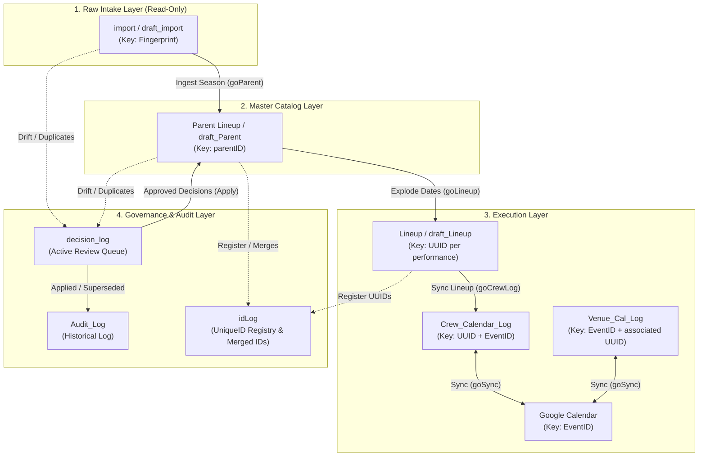

# Scheduler Architecture and Logic

## Runtime

- Platform: Google Apps Script and Google Sheets.
- `Engine.getContext()` is the canonical runtime entrypoint.
- The engine owns workbook configuration, sync state, sheet maps, modes, status rules, audit logging, and identity relationships.
- `scriptLib` contains stable project-agnostic primitives. Scheduler-specific policy remains in `Engine.*`.
- **Context Object (`ctx`):** Initialized once per execution by `engine_core.buildContext()`. It translates spreadsheet-based settings into a machine-readable format to ensure consistent decision-making.

## Metadata Sources
Metadata lives in spreadsheet tabs (referenced in `scriptLib/Sheet_data/` export CSVs):
- `ref`: controlled enumerations for roles, behaviors, actions, decisions, log types, and sheet behavior.
- `ControlPanel`: user settings and system summary values.
- `Mode_Config`: mode policy, write permissions, conflict policy, allowed behaviors/log types, and span policy.
- `Sheet_Settings`: sheet names, roles, ID keys, sync behavior, sync mode, and protection flags.
- `Map_Registry`: field-to-column mappings plus display names, data types, and sync behavior.
- `Status`: the canonical list of row states, colors, and exception/behavior rules.
- `Lookup`: domain lists used by spreadsheet validation.
- `decision_log`: active user decision and action queue; completed decisions are recorded in `Audit_Log` and removed from this queue.
- `idLog`: A registry for unique IDs and an alias table for merged IDs.

## Map Contract

Code references stable `Field Name` values. Physical headers use `Header DisplayName`. Their association is the registry row and `Column Index`.

Runtime operational maps are flat dictionaries mapping `FieldName` directly to integer 0-based `Column Index`:
 
```javascript
// ctx.maps[sheetName] or ctx.getMap(roleOrSheet)
{ EventName: 0, DatesAndTimes: 1, Venue: 2 }
```

Secondary metadata (display names, sync behavior, data types, notes) is maintained in `sheetConfig.columns` under `ctx.sheetDefs`:

```javascript
// ctx.sheetDefs[sheetName].columns[fieldName]
{
  index: 0,
  displayName: "Event Name",
  syncBehavior: "Source (Read-Only)",
  dataType: "String",
  notes: ""
}
```

Range access and column indexing convert through:
- `ctx.getCol(roleOrSheet, fieldName)` (preferred in engine methods)
- `Engine.getColumnIndex(map, fieldName)`
- Direct flat map access: `row[map.FieldName]` or `row[map[fieldName]]`

Metadata access converts through:
- `ctx.getSyncBehavior(roleOrSheet, fieldName)` / `Engine.getSyncBehavior(ctx, roleOrSheet, fieldName)`
- `ctx.getDisplayName(roleOrSheet, fieldName)` / `Engine.getDisplayName(ctx, roleOrSheet, fieldName)`
- `ctx.getColumnDef(roleOrSheet, fieldName)`


## Layered Data Architecture

The workbook operates across four distinct structural layers to maintain deterministic data flow and strict identity isolation:

1. **Raw Intake Layer (`IMPORTCURRENT` / `IMPORTDRAFT`):**
   - **Sheets:** `import`, `draft_import`
   - **Key:** `Fingerprint` | **Mode:** `READ_ONLY` / `SOURCE`
   - External `IMPORTRANGE` feed. Read-only and protected from manual user edits.
   - import is read-only because it is supplied by `IMPORTRANGE`. Its row number is not a permanent identity.

2. **Master Catalog Layer (`PARENTCURRENT` / `PARENTDRAFT`):**
   - **Sheets:** `Parent Lineup`, `draft_Parent`
   - **Key:** `parentID` | **Mode:** `OVERWRITE_ALLOWED` / `MIRROR`
   - Canonical entity identity layer. Maintains event identity across title and date drifts.

3. **Execution Layer (`LINEUPCURRENT` / `LINEUPDRAFT` & Calendars):**
   - **Sheets:** `Lineup`, `draft_Lineup`, `Calls`, `Crew_Calendar_Log`, `Venue_Cal_Log`, `Draft_Season_Log`
   - **Key:** `UUID` | **Mode:** `OVERWRITE_ALLOWED` / `SOURCE` / `SYNC` / `PULL`
   - Granular event instance layer parsed into individual performance dates/times for calendar sync.

4. **Governance Layer:**
   - **Sheets:** `decision_log`, `idLog`, `Audit_Log`, `Sheet_Settings`
   - Intercepts drift, tracks active review tasks, records historical audit logs, and maintains identity aliases.

## Role-Based Sheet Access (`SheetRole`)

All engine functions decouple script logic from static tab names by fetching worksheets via `SheetRole` defined in `Sheet_Settings` (e.g., `getSheetByRole('IMPORTCURRENT')`). 

- Tab name renames inside Google Sheets will never break script execution.
- Enables zero-copy season promotion by swapping `SheetRole` tags in `Sheet_Settings`.

## Identity Chain & `idLog` Alias Table



`import` is read-only because it is supplied by `IMPORTRANGE`. Its row number is not a permanent identity. Parent identity matching must use content/source evidence and preserve an existing `parentID` when continuity is established.

`UniqueID` remains the mixed-form `idLog` key. Its interpretation comes from `RecordType`, source sheet, and location.
## Status, Behavior, and Decisions

- `SyncStatus`: current state/result of a row.
- `Row.Exception` / `Behavior`: whether automatic mutation is allowed.
- `Options`: row-level operational override such as `Bypass`, `Push to Calendar`, or `Prefer Venue Event`.
- `decision_log.Decision`: user conclusion.
- `decision_log.RequestedAction`: requested engine operation.
    - REVIEW_*: create or retain a review item; no automatic data mutation.
    - ACCEPT_*: apply an approved source update.
    - MERGE_*: combine identities and repoint relationships.
    - ADOPT_*: create an explicit cross-sheet association.
    - MARK_*: change an operational state.
    - REFRESH_*: propagate an already-approved upstream change.
- `decision_log.ActionStatus`: processing result.
- `decision_log.ParentTitle` and `CandidateTitle`: the visible pair to compare
  for a Parent-to-Parent duplicate; IDs and row links retain the row identity.

`LOCKED` and `BYPASS` prevent mutation. Detected differences may still be logged and may create a pending decision.

`Possible Duplicate` is a review status, not an automatic command.

## Data Direction

The engine must support explicit modes for:

- pull-only: calendar to sheet;
- push-only: sheet to calendar;
- reconcile-only: compare and report;
- two-way: compare and apply policy-controlled changes.
- **Source-Preference Policy:** Ensure engine prefers source data when destination fields are null/blank.
Calendar event IDs must be preserved during property updates. Initial property patching covers title, start/end, location, and description. Use `ctx.timeZone` for date conversions.
## Developer Overrides

Destructive operations remain available for recovery and initialization, but belong under a confirmed Developer Overrides menu. Examples include resetting Parent Lineup, initializing a log, clearing sync-managed fields, rebuilding headers, repairing hashes, and deleting selected rows.

Developer overrides must show scope and row counts, require confirmation, and write an audit entry.
