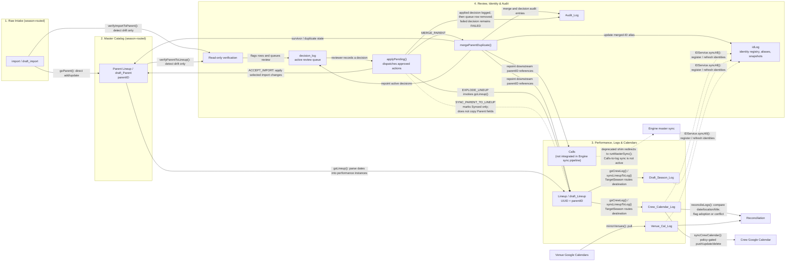
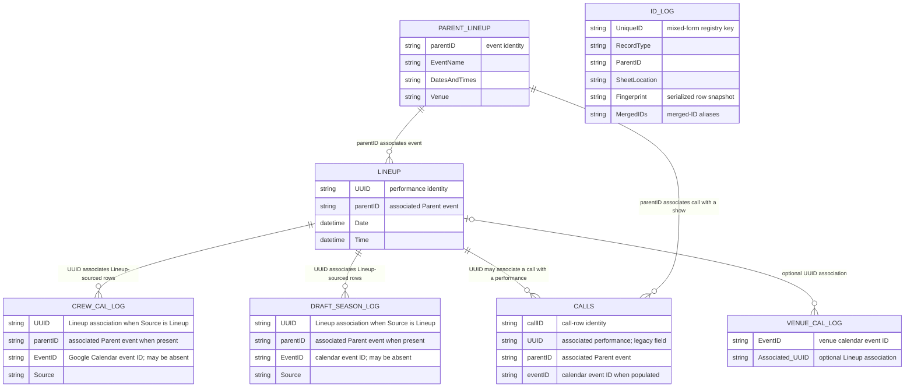

The ER links above describe spreadsheet ID associations, not database-enforced
foreign keys. `idLog` is a registry/alias and snapshot store rather than a
parent table in the event relationship chain. Calls-to-calendar-log sync is
deprecated and is not integrated into the current `Engine.*` sync pipeline.

```mermaid
sequenceDiagram
    autonumber
    actor Reviewer
    participant Intake as Import / Draft Import
    participant Parent as Parent Lineup / draft_Parent
    participant Lineup as Lineup / draft_Lineup
    participant DecLog as decision_log
    participant Apply as applyPending()
    participant IDLog as idLog
    participant Audit as Audit_Log
    participant Calls
    participant CrewLog as Crew_Calendar_Log
    participant DraftLog as Draft_Season_Log
    participant VenueLog as Venue_Cal_Log
    participant Calendar as Google Calendars
    participant EngineSync as Engine.Sync

    Intake->>Parent: goParent() directly adds/updates rows
    Intake->>DecLog: verifyImportToParent() detects drift; queues review
    Parent->>DecLog: verifyParentToLineup() detects drift; queues review
    Note over Intake,DecLog: Both verification functions flag/log differences; neither applies data changes.

    Parent->>Lineup: goLineup() parses dates and reconciles performance instances
    Reviewer->>DecLog: Record decision and requested action
    opt Apply reviewed decisions is invoked
        Apply->>DecLog: Read pending / failed decisions
        alt ACCEPT_IMPORT
            Apply->>Parent: acceptImportDrift(force: true)
        else MERGE_PARENT
            Apply->>Parent: mergeParentDuplicate(keepID, duplicateID)
            Apply->>Lineup: Repoint matching downstream parentID references
            Apply->>Calls: Repoint matching downstream parentID references
            Apply->>CrewLog: Repoint matching downstream parentID references
            Apply->>DraftLog: Repoint matching downstream parentID references
            Apply->>IDLog: Mark duplicate merged; update survivor MergedIDs alias
            Apply->>DecLog: Repoint references in active decisions
        else EXPLODE_LINEUP
            Apply->>Lineup: Invoke goLineup()
        else SYNC_PARENT_TO_LINEUP
            Apply->>Lineup: Mark matching row Synced; no field copy
        end
        Apply->>Audit: Write DECISION_APPLIED; remove queue row
        Note over Apply,DecLog: On failure, write DECISION_FAILED and retain the row as FAILED.
    end

    Lineup->>CrewLog: syncLineupToLog() when TargetSeason is Current
    Lineup->>DraftLog: syncLineupToLog() when TargetSeason is Draft
    CrewLog->>IDLog: IDService.syncAll() refreshes registered identities
    DraftLog->>IDLog: IDService.syncAll() refreshes registered identities
    Note over CrewLog,DraftLog: New log rows are Manual Review; locked/bypassed rows are not overwritten.

    opt Engine.Sync.runMasterSync() phases not skipped
        Calendar->>VenueLog: mirrorVenues() pulls venue calendar events
        CrewLog->>VenueLog: reconcileLogs() compares date/location/title
        Note over CrewLog,VenueLog: Reconciliation flags possible adoption or location conflict; it does not sync Lineup into a log.
        CrewLog->>Calendar: syncCrewCalendar() pushes, updates, or deletes when mode permits
        EngineSync->>IDLog: IDService.syncAll() scans registered identity-bearing sheets
    end
```
