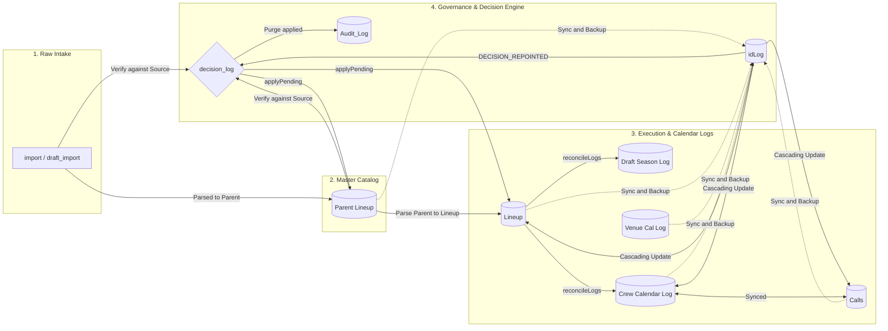
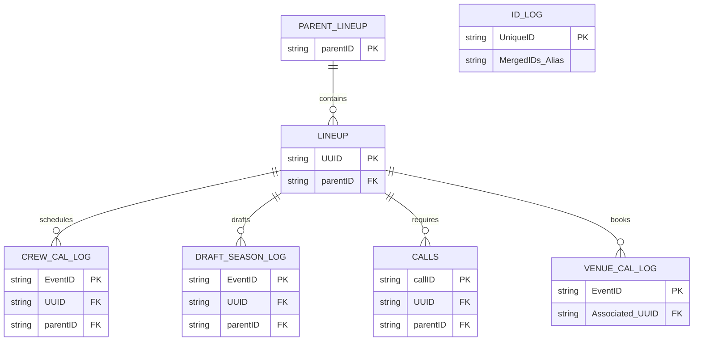
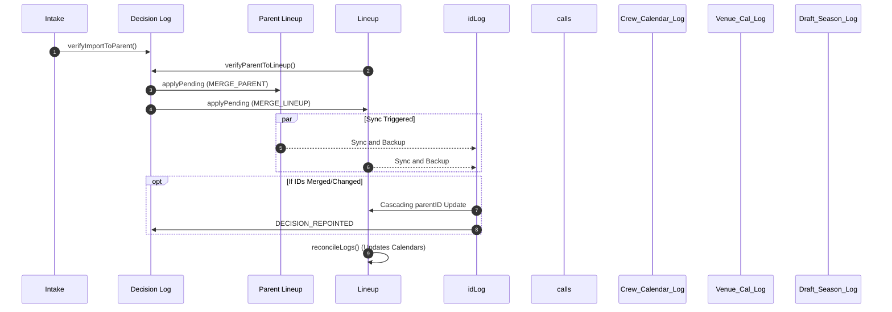

```mermaid
flowchart LR
    subgraph Intake["1. Raw Intake"]
        I[import / draft_import]
    end

    subgraph Catalog["2. Master Catalog"]
        P[(Parent Lineup)]
    end

    subgraph Execution["3. Execution & Calendar Logs"]
        direction TB
        L[(Lineup)]
        D[(Draft Season Log)]
        C[(Crew Calendar Log)]
        V[(Venue Cal Log)]
        Calls[(Calls)]
    end

    subgraph Governance["4. Governance & Decision Engine"]
        DecLog{decision_log}
        IDLog[(idLog)]
        AuditLog[(Audit_Log)]
    end

    %% Core Flow
    I & P -- "Verify against Source" --> DecLog
    I -- "Parsed to Parent" --> P
    DecLog -- "applyPending" --> P & L
    P -- "Parse Parent to Lineup" --> L

    %% Reconciliations
    L -- "reconcileLogs" --> C & D
    Calls <-->|"Synced"| C

    %% Syncs to IDLog (Bundled to prevent crossing lines)
    P & L & V & C & Calls -. "Sync and Backup" .-> IDLog

    %% Cascades & Auditing
    IDLog -- "Cascading Update" --> L & C & Calls
    IDLog -- "DECISION_REPOINTED" --> DecLog
    DecLog -- "Purge applied" --> AuditLog
```

```mermaid
erDiagram
    PARENT_LINEUP ||--o{ LINEUP : "contains"
    LINEUP ||--o{ CREW_CAL_LOG : "schedules"
    LINEUP ||--o{ DRAFT_SEASON_LOG : "drafts"
    LINEUP ||--o{ CALLS : "requires"
    LINEUP ||--o{ VENUE_CAL_LOG : "books"

    PARENT_LINEUP {
        string parentID PK
    }
    LINEUP {
        string UUID PK
        string parentID FK
    }
    CREW_CAL_LOG {
        string EventID PK
        string UUID FK
        string parentID FK
    }
    DRAFT_SEASON_LOG {
        string EventID PK
        string UUID FK
        string parentID FK
    }
    VENUE_CAL_LOG {
        string EventID PK
        string Associated_UUID FK
    }
    CALLS {
        string callID PK
        string UUID FK
        string parentID FK
    }
    ID_LOG {
        string UniqueID PK
        string MergedIDs_Alias
    }
```

```mermaid
sequenceDiagram
    autonumber
    participant Intake
    participant DecLog as Decision Log
    participant Parent as Parent Lineup
    participant Lineup
    participant IDLog as idLog
    participant calls
    participant CrewCal as Crew_Calendar_Log
    participant V as Venue_Cal_Log
    participant D as Draft_Season_Log
    
    Intake->>DecLog: verifyImportToParent()
    Lineup->>DecLog: verifyParentToLineup()
    DecLog->>Parent: applyPending (MERGE_PARENT)
    DecLog->>Lineup: applyPending (MERGE_LINEUP)
    
    par Sync Triggered
        Parent-->>IDLog: Sync and Backup
        Lineup-->>IDLog: Sync and Backup
    end
    
    opt If IDs Merged/Changed
        IDLog->>Lineup: Cascading parentID Update
        IDLog->>DecLog: DECISION_REPOINTED
    end
    
    Lineup->>Lineup: reconcileLogs() (Updates Calendars)
```