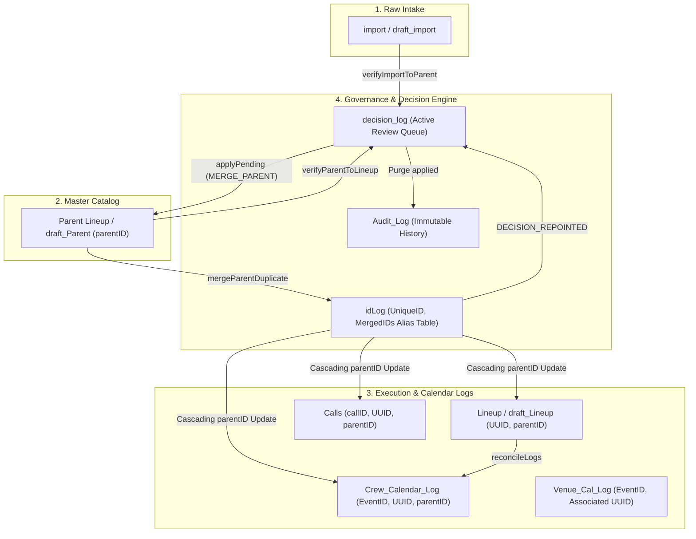

# Implementation Plan: Identity, Decisions, and Reconciliation Pipeline

**Target Issues**:
- [Issue #4: Fully Implement the idLog Alias & Cascading Merger Flow](https://github.com/morrisontheatrical/scheduler3/issues/4)
- [Issue #7: decision_log Queue Purge and Decision History](https://github.com/morrisontheatrical/scheduler3/issues/7)
- [Issue #13: Parent Lineup -> Lineup -> Calendar Reconciliation](https://github.com/morrisontheatrical/scheduler3/issues/13)
- Reference notes: `agent-notes/decision-fixes.md`, `agent-notes/idLog-fixes.md`

---

## Goal Description

The core operational pipeline of Scheduler 3 links raw external intake (`import`) to catalog shows (`Parent Lineup`), granular performance instances (`Lineup`), and synchronized Google Calendars (`Crew_Calendar_Log`, `Venue_Cal_Log`). 

Currently, three tightly connected pillars remain incomplete:
1. **Identity & Merging (#4)**: When duplicate parents merge, `idLog` records the duplicate as `Merged` but lacks a `MergedIDs` alias column on the survivor, and downstream pending decisions still reference the defunct duplicate ID, resulting in stuck decisions.
2. **Decision Queue & History (#7)**: Decision IDs are generated with volatile sheet row numbers (`IMPORT_PARENT_${index+2}_...`), causing reflows to duplicate decision rows. Furthermore, `IMPORT_PARENT` and `IMPORT_DRIFT` duplicate each other, and clean rows are not automatically healed (`markSuperseded` + reset status to `Synced`).
3. **Reconciliation Hierarchy (#13)**: While `verifyImportToParent` creates decisions, `verifyParentToLineup` only sets row values and writes logs without queuing structured decisions or healing resolved rows, and orphan Lineup rows or missing performances are not systematically reconciled down to calendar logs.

This plan addresses all three pillars in a cohesive, four-phase sequence.

---

## User Review Required

> [!IMPORTANT]
> **Schema & Header Updates in `idLog`:**
> Phase 1 adds `MergedIDs` to `idLog` (both in `Map_Registry` and the physical sheet). It also standardizes the `SyncHash` vs `Fingerprint` header column in `idLog` to eliminate latent index mismatch exceptions (resolving #28).

> [!IMPORTANT]
> **Decision Unification (`IMPORT_PARENT` vs `IMPORT_DRIFT`):**
> We unify all import-to-parent drift detection under the canonical type `IMPORT_DRIFT` with a deterministic, content-derived `ReviewID` (`DRIFT_<parentID>_<hash>`). Active legacy `IMPORT_PARENT` decisions in `decision_log` will be supported during transition.

> [!NOTE]
> **History Location:**
> Per `agent-notes/decision-fixes.md`, full temporal decision audit history is preserved in `Audit_Log` (joined by `ReviewID`), while `decision_log` retains `SUPERSEDED` rows until the user runs *Archive Superseded Decisions*. `idLog` acts strictly as an identity registry and live alias table.

---

## Architecture & Data Flow



---

## Proposed Changes

### Phase 1: Identity & Aliasing (`idLog` & Cascading Mergers — #4, #28)

#### [MODIFY] `engine_IDService.js`
- **Standardize `Fingerprint` / `SyncHash` in `idLog`**:
  - In `upsert()`, `syncAll()`, swap lookups to consistently use the registered column name (`Fingerprint`) and fallback safely if `SyncHash` is used.
- **Add `applyLinks(ctx)`**:
  - Automatically add rich hyperlink formulas to `idLog`:
    - `UniqueID` links to source sheet (`SheetLocation`, e.g. `Lineup!R12`).
    - `ParentID` links to the corresponding row in `Parent Lineup`.
  - Export `applyLinks` to diagnostics and run automatically at the conclusion of `syncAll()`.

#### [MODIFY] `engine_ingest.js`
- **Enhance `mergeParentDuplicate(ctx, keepParentID, duplicateParentID)`**:
  - Lookup survivor row in `idLog`. Read existing `MergedIDs` column; append `duplicateParentID` (comma-separated, deduplicated).
  - Update duplicate row in `idLog` with `SyncStatus = "Merged"` and `LogDetails = "Merged into ParentID <keepParentID>"`.
  - Verify and harden cascading `parentID` update across:
    - `Lineup` & `draft_Lineup`
    - `Crew_Calendar_Log` & `Draft_Season_Log`
    - `Venue_Cal_Log`
    - `Calls`
  - Re-point pending decisions in `decision_log`:
    - Scan `decision_log` for any row where `ExistingParentID === duplicateParentID` or `CandidateID === duplicateParentID`.
    - Update `ExistingParentID` / `CandidateID` to `keepParentID`.
    - Log `DECISION_REPOINTED` to `Audit_Log`.

#### [MODIFY] `config.js` & `Map_Registry` helpers
- Ensure `MergedIDs` is registered for `idLog` in `Map_Registry` (`Data Type: Text`, `Sync Behavior: System-Managed`).

---

### Phase 2: Decision Queue Rules & Stable Identity (#7)

#### [MODIFY] `engine_decisions.js`
- **Stable Content-Derived `ReviewID` (`Engine.Decisions.stableReviewID`)**:
  - Implement:
    ```javascript
    stableReviewID: function(type, sourceId, candidateId, evidenceKey) {
      const identity = Engine.getLibraryModule("Identity");
      const hashStr = (identity && typeof identity._hashString === "function")
        ? identity._hashString(evidenceKey || "")
        : Utilities.base64Encode(Utilities.computeDigest(Utilities.DigestAlgorithm.MD5, evidenceKey || "")).slice(0, 8);
      return `${type}_${sourceId || "NA"}_${candidateId || "NA"}_${hashStr}`;
    }
    ```
- **Unify `IMPORT_PARENT` & `IMPORT_DRIFT`**:
  - Standardize drift review types to `IMPORT_DRIFT`.
  - Existing `IMPORT_PARENT` items handled transparently in `applyPending`.
- **Enforce Purge & Archive Rules**:
  - `applyPending`:
    - Successful application (`APPLIED`) and user rejections (`REJECTED`) log full audit details to `Audit_Log` with `ReviewID` and are immediately deleted from `decision_log`.
    - Unresolved or failed rows remain with `ActionStatus = "FAILED"` and `ActionDetails = error.message`.
  - `archiveSuperseded`:
    - Collects all rows where `ActionStatus === "SUPERSEDED"`.
    - Logs each to `Audit_Log` before deleting from `decision_log`.
- **Import Link Resolution in `refreshLinks`**:
  - Support `SourceSheet === "import"` in `refreshLinks` to link `SourceID` / `ImportTitle` directly to the corresponding row in `import` / `draft_import`.

---

### Phase 3: Healing & Drift Reconciliation (#7 & #13)

#### [MODIFY] `engine_ingest.js` (`verifyImportToParent` & `refreshRelevantDecisions`)
- **Clean-Match Healing**:
  - In `verifyImportToParent`:
    - When a matched parent row has `comparison.equal === true`, check its `SyncStatus`.
    - If `SyncStatus` is an engine diagnostic status (`Manual Review`, `Data Drift Detected`, `Possible Duplicate` generated from drift):
      - Reset `SyncStatus` to `Synced` via `Engine.Status.apply(ctx, pRole, rowIdx, "Synced")`.
      - Check `decision_log` for any pending `IMPORT_DRIFT` or `IMPORT_PARENT` review for this `parentID`.
      - If found, mark `markSuperseded(ctx, reviewID, "Drift resolved: Parent Lineup matches import.")`.
    - **Guard**: Never overwrite user-set statuses (`blocksWrite` still takes precedence).
- **Unified Review Refresh (`refreshRelevantDecisions`)**:
  - Consolidate `refreshParentOnlyDecisions` and `refreshParentDuplicateDecisions` into `refreshRelevantDecisions(ctx)`.
  - Re-evaluates all pending decisions against current sheet state, superseding those that are no longer applicable.

#### [MODIFY] `engine_ingest.js` (`verifyParentToLineup`)
- **Structured Drift Reporting & Decision Generation**:
  - Compare expected dates from `DatesAndTimes` with child `Lineup` rows.
  - When drifts occur (date mismatch or venue mismatch), create a structured decision in `decision_log` (`ReviewType: "PARENT_LINEUP_DRIFT"`) with actionable details.
  - Detect **Orphaned Lineup Rows**:
    - Lineup rows whose `parentID` is missing from `Parent Lineup`.
    - Cross-reference `idLog.MergedIDs`: if the parent was merged, auto-repoint child to the survivor. If genuinely missing, queue `ReviewType: "LINEUP_ORPHAN"`.
  - Detect **Missing Lineup Children**:
    - Parent has 3 performance dates, but only 2 Lineup rows exist.
    - Queue `ReviewType: "LINEUP_MISSING_PERFORMANCE"` or auto-explode if in Draft mode.
  - **Clean-Match Healing**:
    - If a Lineup row matches Parent Lineup, reset `Manual Review` back to `Synced` and supersede open `PARENT_LINEUP_DRIFT` reviews.

---

### Phase 4: Lineup to Calendar Reconciliation (#13)

#### [MODIFY] `engine_sync.js`
- **Reconcile Lineup vs Calendar Logs**:
  - Ensure every confirmed `Lineup` performance row is mapped to an entry in `Crew_Calendar_Log`.
  - Check for `SyncHash` or date/time drift between `Lineup` and `Crew_Calendar_Log`.
  - Update `reconcileLogs` to check `idLog.MergedIDs` when matching venue and crew events to prevent false `Location Conflict` warnings on merged show titles.

#### [MODIFY] `0_OnOpen.js`
- Update menu actions:
  - Add `Refresh Stale Reviews` (`refreshRelevantDecisions`) under Decision menu.
  - Add `Refresh ID Registry Links` (`test_RefreshIDRegistryLinks`) under Diagnostics menu.

---

## Verification Plan

### Automated / Diagnostic Tests (`0_temp.js`)
We will add automated validation suites in `0_temp.js`:
1. `test_StableReviewID()`:
   - Generate ReviewID for synthetic drift; ensure identical ID generated across repeated reflows with the same data.
   - Alter a field value; assert new ReviewID generated.
2. `test_CascadeAndMergedIDs()`:
   - Create mock parent records in test context; run `mergeParentDuplicate()`.
   - Assert survivor's `MergedIDs` contains duplicate ID.
   - Assert child rows in Lineup, Crew_Calendar_Log, and Calls updated with survivor ID.
   - Assert decision with duplicate ID re-pointed to survivor with `DECISION_REPOINTED` in `Audit_Log`.
3. `test_HealingCycle()`:
   - Simulate drift -> verify queues decision & sets `Manual Review`.
   - Simulate drift resolution -> verify clears decision to `SUPERSEDED` and restores status to `Synced`.

### Manual User Verification
1. **Duplicate Merge Flow**:
   - In `decision_log`, select `CONFIRMED_DUPLICATE` on a parent pair and run **Apply Reviewed Decisions**.
   - Verify:
     - Duplicate parent deleted from `Parent Lineup`.
     - `idLog` shows duplicate marked `Merged` and survivor row lists the old ID in `MergedIDs`.
     - Dependent rows in `Lineup` and `Crew_Calendar_Log` update to survivor ID.
     - Decision row deleted from `decision_log` and logged in `Audit_Log`.
2. **Re-Verify Stability**:
   - Run **Verify Import vs Parent Lineup**.
   - Confirm previously accepted rows do NOT re-queue into `decision_log`.
3. **Parent vs Lineup Verification**:
   - Run **Verify Parent Lineup vs Lineup**.
   - Verify unparseable dates, drifts, and missing instances are reported accurately.
