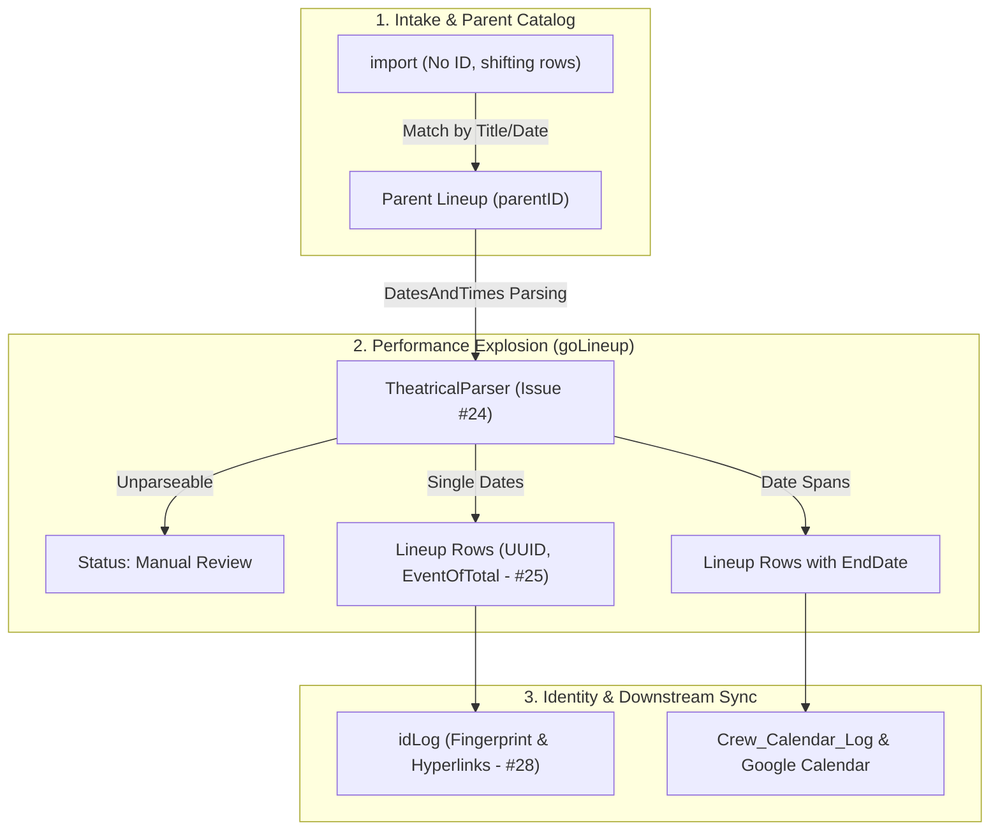

# Implementation Plan: Identity, Date Parsing Pipeline, and Bug Priorities (#28, #25, #24)

## Goal Description & Architectural Context

Thank you for clarifying the project history—that context clarifies several design tensions in the code:
1. **Fingerprint vs. Hashing**: 
   - **Fingerprint** was the original design: a human-readable delineated representation of a row's values to compare against raw `import` data (which shifts and has no stable ID).
   - **Hashing (SyncHash)** was introduced later as an efficiency layer for scriptLib and fast sheet-to-sheet sync.
   - Over time, `idLog`'s column was named `Fingerprint`, but the code populated it with the MD5 hash, causing the header-lookup mismatch in **#28**.
2. **Import → Parent → Lineup Pipeline (The Evolution from "Condensed Lineup")**:
   - In older versions, a formula-driven middle tab ("Condensed Lineup") used `=Import!A:A` to inject helper columns (`AfterToday`, `WithinQuarter`, etc.) before parsing into `Lineup`.
   - In Scheduler 3, the engine replaced the formula tab with programmatic ingest:
     - `import` → `Parent Lineup` (catalog shows with `parentID`)
     - `Parent Lineup` → `Lineup` (`goLineup()` explodes `DatesAndTimes` into individual performance rows with `UUID`, `parentID`, `EventOfTotal`, and derived R1C1 formulas).
3. **Date Spans & `EndDate`**:
   - Multi-day runs or spans are detected by `TheatricalParser`.
   - `Lineup` now has an `EndDate` column to support `MULTI_DAY` spans, but downstream propagation (e.g., to `Crew_Calendar_Log` and Google Calendar event end times) needs completion.

---

## User Review Required & Clarifying Questions

> [!IMPORTANT]
> **Question 1: `idLog.Fingerprint` — Readable Delineated String or Full JSON Snapshot?**
> Now that we know `Fingerprint` was originally a delineated string of key fields:
> - **Option A (Delineated String + Hash)**: `idLog.Fingerprint` stores a clean, readable string (e.g., `Hamlet | 2026-06-05 | 19:30 | Theatre 166`), while `SyncHash` remains the operational hash on data sheets (`Lineup`, `Crew_Log`).
> - **Option B (Full JSON Snapshot)**: `idLog.Fingerprint` stores a complete JSON snapshot of the row via `Engine.IO.serializeRow()` (per ROADMAP item #6/25) for post-merge recovery of deleted shows.
> *(Recommendation: Option A for daily visual legibility in `idLog`, using Audit_Log for serialized JSON snapshots).*

> [!IMPORTANT]
> **Question 2: Status for Unparseable Dates (#24)**
> When `DatesAndTimes` has text that cannot be parsed into any date or span:
> - Currently, the engine only logs to `Audit_Log` and skips the row silently.
> - We propose setting `SyncStatus` to **`Manual Review`** (or `Date Parse - Manual Review` if in `Status.csv`) on `Parent Lineup` so the row is visibly flagged for human intervention on the sheet, matching the existing `Date Span - Manual Review` pattern. Do you agree?

> [!IMPORTANT]
> **Question 3: Downstream Propagation of `EndDate`**
> In `Lineup`, multi-day spans write `Date` (start date) and `EndDate`. 
> When syncing from `Lineup` to `Crew_Calendar_Log` / Google Calendar:
> - Should multi-day Lineup rows create multi-day calendar events spanning from `Date` to `EndDate`?

---

## Proposed Changes



### Component 1: Architecture & Roadmap Documentation
#### [MODIFY] `ARCHITECTURE.md`
- Document the definitive distinction between:
  - **`SyncHash`**: 8-char MD5 hash of key comparison fields (`Title | Date | Time | Venue`) on operational data sheets (`Lineup`, `Crew_Calendar_Log`, `Venue_Cal_Log`).
  - **`Fingerprint`**: The delineated, human-readable cell representation on `idLog`, tracing back to the original change-detection design before hashing.
  - Document that `import` does not possess persistent IDs due to shifting rows.

#### [MODIFY] `ROADMAP.md`
- Elevate **#28** (ID Registry column fix), **#25** (Lineup field population), and **#24** (Date parsing & manual review flag) into `## Immediate Priorities`.

---

### Component 2: Date Parsing Pipeline & Manual Review Flagging (#24 & #13)
#### [MODIFY] `engine_ingest.js`
- In `goLineup()` and `verifyParentToLineup()`:
  - If `parsedDates.dates.length === 0 && parsedDates.spans.length === 0`:
    - Apply `Engine.Status.apply(ctx, pRole, rowIdx, "Manual Review", ...)` on `Parent Lineup`.
    - Paint the status and record the details in `UpdateDetails` so the operator sees exactly what text failed to parse.

---

### Component 3: Complete Missing Lineup Fields (#25)
#### [MODIFY] `engine_ingest.js` (`goLineup`)
- Ensure all expected columns are populated:
  - **`EventOfTotal`**: Format `${index + 1} of ${entries.length}` written during insertion and updated if performance count changes.
  - **`EndDate`**: Correctly written when `policy === "MULTI_DAY"`.
  - **`AfterToday`, `WithinQuarter`, `WithinMonth`**: Injected via `ensureDerivedFormulas` with relative R1C1 formulas (`=RC[col]>=TODAY()`, etc.).
  - **`LastUpdated`**: Set to `new Date()` whenever row fields are updated.
  - **`SyncStatus`**: Default to `"Draft"` on initial explosion, painted with status colors.

---

### Component 4: Finalize ID-Registry Column Handling (#28)
#### [MODIFY] `engine_IDService.js`
- Maintain canonical lookup for `Fingerprint` with automatic fallback to `SyncHash` to ensure zero range-index errors regardless of whether the user's sheet has been migrated yet.
- Verify `applyLinks()` links `UniqueID` to `SheetLocation` and `ParentID` to `Parent Lineup`.

---

## Verification Plan

### Automated / Diagnostic Tests
```bash
node -c *.js # Verify all JS syntax
```
- In `0_temp.js`, run `test_TheatricalDateParsing()` to verify:
  - Multi-date extraction
  - Span detection
  - TBA handling
  - Time-range extraction

### Manual Verification in Google Sheets
1. **Unparseable Date Test**:
   - Set a Parent Lineup row to an invalid date string (e.g., `"TBD summer run"`).
   - Run `Ingest -> Explode to Lineup`.
   - Confirm row is flagged **`Manual Review`** (or `Date Span - Manual Review`) with clear cell/audit feedback.
2. **Missing Lineup Fields Test (#25)**:
   - Check an exploded multi-performance show.
   - Confirm `EventOfTotal` has values like `1 of 4`, `2 of 4`.
   - Confirm formulas in `AfterToday`, `WithinQuarter`, `WithinMonth` calculate correctly.
   - Confirm `LastUpdated` is populated.
3. **ID Registry Sync Test (#28)**:
   - Run `Dev / Test -> Diagnostics -> Refresh ID Registry Links`.
   - Confirm no "starting column of the range is too small" error occurs.
